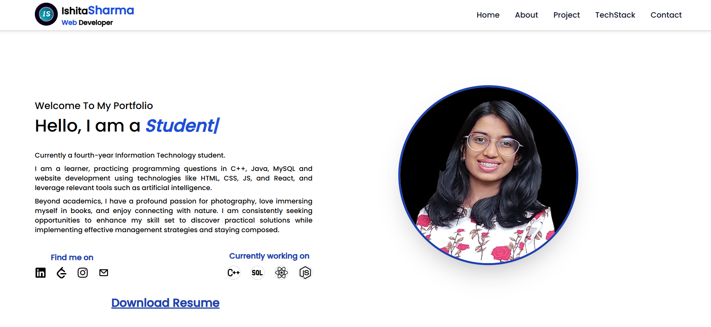

# My Portfolio Website
A showcase of my skills, built using React and styled with Tailwind CSS.

## Overview
This is a React project that includes a variety of components to create a dynamic and responsive web application. The project features a dark mode theme and a structured layout with multiple sections.

# Link
https://ishita-portfolioweb.vercel.app/

# Screenshot

## Components
- Navbar: A navigation bar that allows users to easily navigate between different sections of the application.
- Home: The home section of the application, typically showcasing an introduction or welcome message.
- About: A section providing information about the project or the author.
- Projects: A section displaying various projects or portfolio items.
- TechStack: A section highlighting the technology stack used in the project.
- Contact: A section with contact information or a contact form.
-Footer: A footer section that appears at the bottom of the page.

# Usage
The application is structured to provide a seamless user experience with dark mode support. You can navigate through different sections using the navigation bar, and each section is designed to be responsive and user-friendly.

# Installation
- Clone the repository: git clone https://github.com/ishita5189/PortfolioWebsite.git
- Navigate to the project directory: cd PortfolioWebsite
- Install the dependencies: npm install
- Start the application: npm run dev

# Features
- Dark Mode: A dark mode feature that enhances readability in low-light environments.
- Responsive Design: The website is designed to be fully responsive on different devices.
- Modular Components: Organized components for easier maintenance and scalability.

# Contributing
Contributions are welcome! Feel free to fork the repository and submit pull requests with improvements or bug fixes. For significant changes, please open an issue to discuss your ideas.

# Acknowledgments
- React: For the powerful component-based architecture.
- Tailwind CSS: For its utility-first CSS framework which aids in styling.

---

For any questions or inquiries, please feel free to contact me through the contact form on the website or via email.
